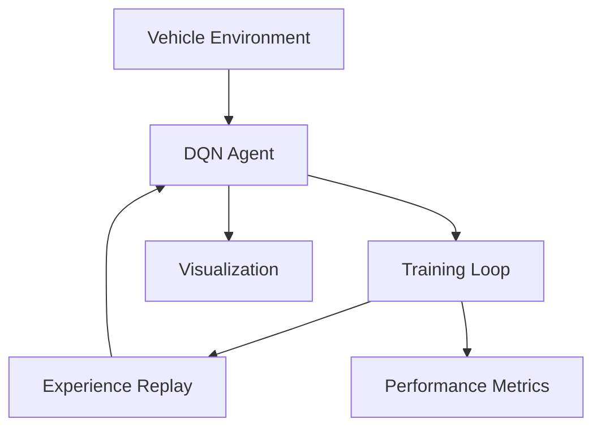

# Autonomous Vehicle Navigation 🚗🎮


A reinforcement learning implementation for autonomous vehicle navigation using Deep Q-Learning (DQN). This project demonstrates how to train an AI agent to navigate through obstacles to reach a goal.

## 📖 Table of Contents
- [Project Overview](#-project-overview)
- [Technical Features](#-technical-features)
- [Installation & Setup](#-installation--setup)
- [Implementation Details](#-implementation-details)
- [Training Process](#-training-process)
- [Performance Analysis](#-performance-analysis)
- [Development](#-development)
- [Contributing](#-contributing)

## 🎯 Project Overview

### 🤖 Core Components
- **Visualization Engine**: Pygame-based rendering system
- **Environment**: Custom Gymnasium environment for vehicle navigation
- **DQN Agent**: PyTorch implementation of Deep Q-Learning
- **Training System**: Complete pipeline with experience replay
- **Analytics**: Real-time performance monitoring and visualization

### 🎮 Key Features
- Real-time visualization of training process
- Dynamic obstacle generation
- Customizable environment parameters
- Comprehensive performance metrics
- Path visualization through heatmaps

## 🛠 Technical Architecture

### System Components


### Dependencies
```python
# requirements.txt
numpy>=1.20.0
torch>=1.9.0
pygame>=2.0.0
gymnasium>=0.26.0
matplotlib>=3.4.0
seaborn>=0.11.0
```

## 💻 Installation & Setup

### System Requirements
- Python 3.8+
- 8GB RAM (minimum)
- CUDA-compatible GPU (recommended)
- 5GB storage

### Quick Start
```bash
# Clone repository
git clone https://github.com/yourusername/autonomous-vehicle-nav.git

# Navigate to project
cd autonomous-vehicle-nav

# Create virtual environment
python -m venv venv
source venv/bin/activate  # Linux/Mac
.\venv\Scripts\activate   # Windows

# Install dependencies
pip install -r requirements.txt
```

## 🔬 Implementation Details

### Environment Configuration
```python
SCREEN_WIDTH = 800
SCREEN_HEIGHT = 600
VEHICLE_SIZE = 20
OBSTACLE_SIZE = 30
N_OBSTACLES = 10
```

### DQN Architecture
```python
class DQN(nn.Module):
    def __init__(self, input_size, output_size):
        super().__init__()
        self.network = nn.Sequential(
            nn.Linear(input_size, 128),
            nn.ReLU(),
            nn.Linear(128, 64),
            nn.ReLU(),
            nn.Linear(64, output_size)
        )
```

## 📈 Training Process

### Hyperparameters
- Learning Rate: 0.001 (Adam optimizer)
- Discount Factor (γ): 0.99
- Epsilon Decay: 0.995
- Minimum Epsilon: 0.01
- Replay Buffer Size: 10,000
- Batch Size: 64

### Reward Structure
- Goal Reached: +100
- Obstacle Collision: -50
- Step Penalty: -0.1

## ⚡ Performance Analysis

### Metrics Tracked
- Episode Scores
- Success Rate
- Epsilon Decay
- Path Distribution

### Visualization Tools
```python
def plot_training_metrics(scores, epsilons, success_rate):
    plt.figure(figsize=(15, 10))
    # Plot scores, epsilon decay, and success rate
```

## 👨‍💻 Development

### Project Structure
```
autonomous-vehicle/
├── src/
│   ├── environment.py
│   ├── agent.py
│   ├── visualization.py
│   └── training.py
├── notebooks/
│   └── analysis.ipynb
├── tests/
│   └── test_env.py
├── requirements.txt
└── README.md
```

### Run Training
```python
if __name__ == "__main__":
    scores, epsilons, success_rate = train_agent()
```

## 🤝 Contributing

### Guidelines
1. Fork repository
2. Create feature branch
3. Follow PEP 8 style guide
4. Add unit tests
5. Submit pull request

### Development Workflow
- Use virtual environment
- Run tests before committing
- Update documentation
- Maintain clean notebook outputs

## 📄 License

This project is licensed under the MIT License - see the [LICENSE](LICENSE) file for details.

## 🙏 Acknowledgments

- PyTorch team
- Gymnasium maintainers
- Pygame community
- OpenAI for DQN architecture inspiration
